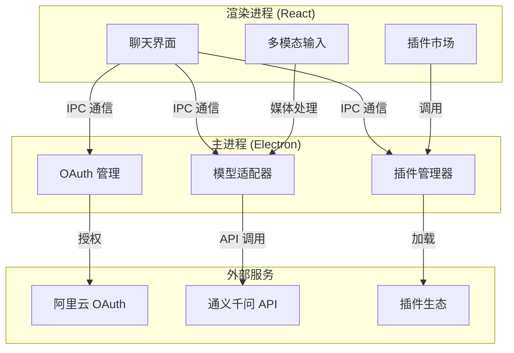

# OpenCrab 🦀

**专为中文用户打造的 AI Agent 桌面应用 - 一键登录，全模态交互，完全免费**

[](https://github.com/opencrab/opencrab/releases)
[](LICENSE)
[](https://github.com/opencrab/opencrab/releases)

---

## ✨ 为什么选择 OpenCrab？

- 🇨🇳 **中文优化** - 深度适配中文场景，内置公文写作、小红书分析等本土化插件
- 🔐 **OAuth 免费** - 阿里云/腾讯云等国内平台 OAuth 认证，无需配置 API Key
- 🎨 **全模态输入** - 支持文本、图片、语音多模态交互，沟通更自然
- 📦 **一键安装** - Windows/macOS/Linux 三平台安装包，自动更新无感升级
- 🔌 **插件生态** - 开放的插件系统，轻松扩展专属能力

---

## 🚀 快速开始

### 1️⃣ 下载安装包

访问 [GitHub Releases](https://github.com/opencrab/opencrab/releases) 下载对应系统的安装包：

- **Windows**: `OpenCrab-{version}-setup-x64.exe` (约 125MB)
- **macOS**: `OpenCrab-{version}-mac-x64.dmg` (约 115MB)
- **Linux**: `OpenCrab-{version}-linux-x64.AppImage` (约 120MB)

### 2️⃣ 安装应用

- **Windows**: 双击安装包，等待自动安装完成
- **macOS**: 打开 DMG，拖拽到 Applications 文件夹
- **Linux**: 赋予执行权限后运行 `./OpenCrab-{version}.AppImage`

### 3️⃣ 登录使用

1. 打开 OpenCrab
2. 选择登录方式（阿里云/腾讯云/其他）
3. 浏览器完成 OAuth 授权
4. 开始聊天或安装插件！

---

## 🎯 核心功能

### 💬 智能对话
- 支持通义千问、文心一言等国产大模型
- 流式响应，实时显示思考过程
- Markdown 渲染 + 代码高亮

<!-- 截图占位符 1: 聊天界面 -->
<!-- 需要补充：展示流式响应、Markdown 渲染效果的聊天截图 -->


### 📸 多模态交互
- **图片理解**: 上传图片进行分析说明
- **语音输入**: 按住录音，松开即发送
- **文件处理**: 支持多种格式附件

<!-- 截图占位符 2: 多模态输入 -->
<!-- 需要补充：展示图片预览、录音控件、附件管理的截图 -->


### 🔌 插件市场
- **小红书笔记分析器**: AI 拆解爆款笔记，生成优化报告
- **中文公文写作助手**: 5 种模板生成规范公文
- 更多插件持续上架...

<!-- 截图占位符 3: 插件市场 -->
<!-- 需要补充：展示插件卡片、分类筛选、启用开关的截图 -->


### 🔐 一键登录
- 无需记忆 API Key
- 使用阿里云/腾讯云等现有账号
- 安全存储于系统钥匙串

<!-- 截图占位符 4: 登录页面 -->
<!-- 需要补充：展示 OAuth 授权按钮、登录状态的截图 -->


---

## 🏗️ 技术架构



### 核心技术栈
- **桌面框架**: Electron 28 + TypeScript
- **前端 UI**: React 18 + Vite + TailwindCSS
- **状态管理**: Zustand
- **模型适配**: Strategy 模式
- **沙箱隔离**: Node.js VM 模块

---

## 🤝 参与贡献

### 提交 Bug
发现 Bug？请前往 [Issues](https://github.com/opencrab/opencrab/issues) 提交：
1. 选择「Bug Report」模板
2. 填写复现步骤、预期行为、实际行为
3. 附上截图或日志（如有）

### 建议功能
有新想法？欢迎提 [Feature Request](https://github.com/opencrab/opencrab/issues)：
1. 描述使用场景
2. 说明解决的问题
3. 提供实现思路（可选）

### 开发插件
想贡献插件？参考以下步骤：
```bash
# 1. Fork 项目
git clone https://github.com/your-name/opencrab.git

# 2. 创建插件目录
mkdir -p src/plugins/your-plugin-name

# 3. 编写 manifest.json 和 index.js
# 详见 docs/PLUGIN_DEVELOPMENT.md

# 4. 提交 PR
git add .
git commit -m "feat(plugin): add your-plugin-name"
git push origin main
```

### 翻译文档
帮助完善多语言文档：
- 校对中文翻译
- 补充英文版本
- 优化表达措辞

---

## 📄 开源协议

本项目采用 [MIT License](LICENSE) 开源协议。

- ✅ 允许商业使用
- ✅ 允许修改分发
- ✅ 允许私有部署
- ⚠️ 需保留版权声明

---

## 🙏 致谢

感谢以下开源项目：
- [Electron](https://www.electronjs.org/) - 桌面应用框架
- [Vite](https://vitejs.dev/) - 前端构建工具
- [TailwindCSS](https://tailwindcss.com/) - CSS 框架
- [markdown-it](https://markdown-it.github.io/) - Markdown 渲染

---

## 📬 联系方式

- **项目地址**: https://github.com/opencrab/opencrab
- **问题反馈**: https://github.com/opencrab/opencrab/issues
- **讨论区**: https://github.com/opencrab/opencrab/discussions

---

**Made with ❤️ for Chinese Users**
