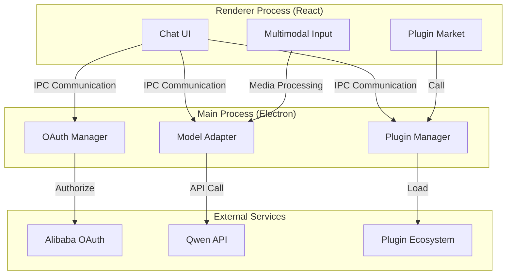

# OpenCrab 🦀

**AI Agent Desktop App for Chinese Users - One-Click Login, Multimodal Interaction, Completely Free**

[](https://github.com/opencrab/opencrab/releases)
[](LICENSE)
[](https://github.com/opencrab/opencrab/releases)

---

## ✨ Why OpenCrab?

- 🇨🇳 **Chinese Optimized** - Deep localization with plugins like official document writer and social media analyzer
- 🔐 **Free OAuth** - No API key needed, login with existing accounts from Alibaba Cloud/Tencent Cloud
- 🎨 **Multimodal Input** - Text, image, and voice interaction for natural communication
- 📦 **One-Click Install** - Cross-platform installers with automatic silent updates
- 🔌 **Plugin Ecosystem** - Extensible plugin system for custom capabilities

---

## 🚀 Quick Start

### 1️⃣ Download

Visit [GitHub Releases](https://github.com/opencrab/opencrab/releases) to download:

- **Windows**: `OpenCrab-{version}-setup-x64.exe` (~125MB)
- **macOS**: `OpenCrab-{version}-mac-x64.dmg` (~115MB)
- **Linux**: `OpenCrab-{version}-linux-x64.AppImage` (~120MB)

### 2️⃣ Install

- **Windows**: Double-click installer, wait for auto-installation
- **macOS**: Open DMG, drag to Applications folder
- **Linux**: Make executable and run `./OpenCrab-{version}.AppImage`

### 3️⃣ Use

1. Launch OpenCrab
2. Choose login method (Alibaba Cloud/Tencent Cloud/etc.)
3. Complete OAuth authorization in browser
4. Start chatting or install plugins!

---

## 🎯 Core Features

### 💬 Smart Chat
- Support for Qwen, ERNIE Bot and other Chinese LLMs
- Streaming response with real-time display
- Markdown rendering + code highlighting

<!-- Screenshot Placeholder 1: Chat Interface -->
<!-- TODO: Add screenshot showing streaming response and Markdown rendering -->


### 📸 Multimodal Interaction
- **Image Understanding**: Upload images for analysis
- **Voice Input**: Hold to record, release to send
- **File Attachment**: Support multiple formats

<!-- Screenshot Placeholder 2: Multimodal Input -->
<!-- TODO: Add screenshot showing image preview, recording controls, attachments -->


### 🔌 Plugin Market
- **Xiaohongshu Analyzer**: AI-powered social media content analysis
- **Chinese Document Writer**: Generate official documents with 5 templates
- More plugins coming soon...

<!-- Screenshot Placeholder 3: Plugin Market -->
<!-- TODO: Add screenshot showing plugin cards, categories, enable switches -->


### 🔐 One-Click Login
- No API key memorization needed
- Use existing accounts from cloud providers
- Securely stored in system keychain

<!-- Screenshot Placeholder 4: Login Page -->
<!-- TODO: Add screenshot showing OAuth buttons and login status -->


---

## 🏗️ Architecture



### Tech Stack
- **Desktop Framework**: Electron 28 + TypeScript
- **Frontend UI**: React 18 + Vite + TailwindCSS
- **State Management**: Zustand
- **Model Adapter**: Strategy Pattern
- **Sandbox Isolation**: Node.js VM Module

---

## 🤝 Contributing

### Report Bugs
Found a bug? Please submit via [Issues](https://github.com/opencrab/opencrab/issues):
1. Select "Bug Report" template
2. Fill in reproduction steps, expected vs actual behavior
3. Attach screenshots or logs if available

### Suggest Features
Have ideas? Submit a [Feature Request](https://github.com/opencrab/opencrab/issues):
1. Describe the use case
2. Explain the problem it solves
3. Provide implementation hints (optional)

### Develop Plugins
Want to contribute a plugin? Follow these steps:
```bash
# 1. Fork the project
git clone https://github.com/your-name/opencrab.git

# 2. Create plugin directory
mkdir -p src/plugins/your-plugin-name

# 3. Write manifest.json and index.js
# See docs/PLUGIN_DEVELOPMENT.md for details

# 4. Submit PR
git add .
git commit -m "feat(plugin): add your-plugin-name"
git push origin main
```

### Translate Documentation
Help improve multilingual docs:
- Proofread Chinese translations
- Supplement English versions
- Optimize expressions

---

## 📄 License

This project is licensed under the [MIT License](LICENSE).

- ✅ Commercial use permitted
- ✅ Modification and distribution allowed
- ✅ Private deployment allowed
- ⚠️ Must retain copyright notice

---

## 🙏 Acknowledgments

Thanks to the following open source projects:
- [Electron](https://www.electronjs.org/) - Desktop application framework
- [Vite](https://vitejs.dev/) - Build tool
- [TailwindCSS](https://tailwindcss.com/) - CSS framework
- [markdown-it](https://markdown-it.github.io/) - Markdown renderer

---

## 📬 Contact

- **Project URL**: https://github.com/opencrab/opencrab
- **Issue Tracker**: https://github.com/opencrab/opencrab/issues
- **Discussions**: https://github.com/opencrab/opencrab/discussions

---

