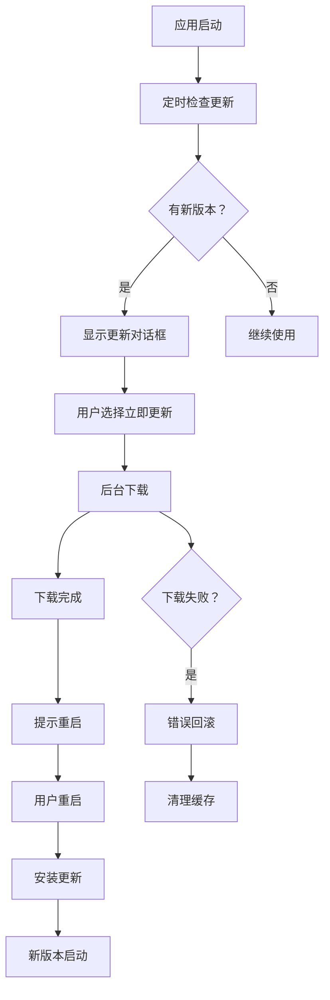

# OpenCrab 构建配置指南

## 📦 生产级打包配置

### 1. electron-builder.yml 核心配置

```yaml
appId: com.opencrab.app
productName: OpenCrab

# 双平台输出
win:
  target: nsis (x64, arm64)

mac:
  target: dmg + zip (x64, arm64)

# 预编译原生模块
nodeGypRebuild: false
npmRebuild: true

# 压缩级别
compression: maximum
```

**关键优化：**
- ✅ 禁用 node-gyp 重建（使用预编译二进制）
- ✅ 启用 npm rebuild（确保依赖正确）
- ✅ 最大压缩级别（减小体积）
- ✅ 排除开发依赖和源文件

---

### 2. 原生模块处理

#### **包含的原生模块：**
1. **keytar** - 密钥存储（系统钥匙串）
2. **sharp** - 图片处理（主进程）
3. **fluent-ffmpeg** - 音频转码（主进程）

#### **预编译策略：**
```bash
# postinstall 钩子自动下载预编译二进制
npm run postinstall
# 执行：electron-builder install-app-deps
```

---

### 3. macOS 代码签名与公证

#### **步骤 1：获取开发者证书**

1. 加入 [Apple Developer Program](https://developer.apple.com/) ($99/年)
2. 访问 [Certificates, Identifiers & Profiles](https://certificates.apple.com/)
3. 创建 **Developer ID Application** 证书
4. 导出 `.p12` 文件

#### **步骤 2：配置环境变量**

```bash
# ~/.zshrc 或 GitHub Actions Secrets
export CSC_LINK="Developer ID Application: Your Name (TEAM_ID)"
export CSC_KEY_PASSWORD="证书密码"
export APPLE_ID="your@email.com"
export APPLE_APP_SPECIFIC_PASSWORD="App-specific password"
export APPLE_TEAM_ID="团队 ID"
```

**生成 App-specific Password：**
1. 访问 https://appleid.apple.com/
2. 登录 → 安全 → App-Specific Passwords
3. 生成新密码（格式：xxxx-xxxx-xxxx-xxxx）

#### **步骤 3：运行 notarize.js**

```javascript
// scripts/notarize.js
const { notarize } = require('@electron/notarize');

await notarize({
  appBundleId: 'com.opencrab.app',
  appPath: 'release/OpenCrab.app',
  appleId: process.env.APPLE_ID,
  appleIdPassword: process.env.APPLE_APP_SPECIFIC_PASSWORD,
  teamId: process.env.APPLE_TEAM_ID,
  tool: 'notarytool',  // 使用新的 notarytool
});
```

**公证流程：**
```
codesign → zip → 上传 Apple 服务器 → 等待结果 → stapling
预计耗时：5-15 分钟
```

---

### 4. Windows 签名（可选）

#### **获取代码签名证书：**
- DigiCert、Sectigo、GlobalSign 等 CA 机构
- 需要 EV 证书才能通过 SmartScreen 筛选器

#### **配置签名：**
```yaml
win:
  signingHashAlgorithms:
    - sha256
  signatureFileFlags: APPEND_TIMESTAMP
```

---

## 🚀 自动更新实现

### 1. electron-updater 集成

#### **安装依赖：**
```bash
npm install electron-updater
```

#### **配置发布源：**
```yaml
# electron-builder.yml
publish:
  provider: github
  owner: opencrab
  repo: opencrab
```

#### **使用 UpdaterManager：**
```typescript
import { updaterManager } from './main/updater';

app.whenReady().then(() => {
  updaterManager.init(mainWindow);
});
```

#### **渲染进程监听：**
```typescript
window.electron.ipcRenderer.on('updater:event', (event, data) => {
  console.log('更新事件:', data.event, data.data);
  
  switch (data.event) {
    case 'available':
      // 显示更新提示
      break;
    case 'progress':
      // 更新进度条
      console.log(`下载进度：${data.data.percent}%`);
      break;
    case 'downloaded':
      // 提示重启
      break;
  }
});
```

---

### 2. 更新流程



---

### 3. 断点续传支持

electron-updater 内置断点续传：

```typescript
autoUpdater.autoDownload = true;  // 自动下载
autoUpdater.allowDowngrade = false;  // 不允许降级

// 下载中断后，下次检查会自动继续
```

**原理：**
- 下载分块进行
- 每块计算哈希校验
- 中断后从最近的块继续

---

## 🛠️ 构建脚本使用

### **本地构建：**

```bash
# 构建当前平台
npm run build

# 构建所有平台（需要对应操作系统）
npm run build:all

# 仅构建 Windows
npm run build:win

# 仅构建 macOS
npm run build:mac

# 仅构建 Linux
npm run build:linux

# 跳过测试
bash scripts/build-ci.sh --skip-tests

# 清理构建产物
bash scripts/build-ci.sh --clean
```

### **GitHub Actions CI：**

推送标签自动触发：
```bash
git tag v0.1.0
git push origin v0.1.0
```

**工作流：**
1. 检出代码
2. 安装 Node.js 20
3. 安装依赖
4. 类型检查 + Lint
5. 构建主进程 + 渲染进程
6. 多平台并行打包
7. 上传到 GitHub Releases

---

## 📊 构建体积优化

### **目标：≤ 150MB**

#### **优化措施：**

1. **Tree Shaking（Vite 自动）**
   ```typescript
   // vite.config.ts
   export default defineConfig({
     build: {
       minify: 'terser',
       rollupOptions: {
         output: {
           manualChunks: {
             vendor: ['react', 'react-dom'],
             utils: ['lodash', 'axios'],
           },
         },
       },
     },
   });
   ```

2. **按需加载模型适配器**
   ```typescript
   // 动态 import
   const adapter = await import('./adapters/models/qwen.adapter');
   ```

3. **压缩资源**
   ```bash
   # 图片压缩
   npm install imagemin
   
   # 音频压缩
   npm install ffmpeg-static
   ```

4. **排除文件**
   ```yaml
   files:
     - dist/**/*
   exclude:
     - '**/*.ts'
     - '**/*.tsx.map'
     - 'src/**/*'
     - 'docs/**/*'
   ```

---

## 🔍 故障排查

### **构建失败常见原因：**

#### **1. 原生模块编译失败**
```bash
# 解决方案
rm -rf node_modules
npm cache clean --force
npm ci
npm run postinstall
```

#### **2. macOS 签名失败**
```
Error: Exit code: 1. Command failed: codesign ...
```
**解决：**
- 检查证书是否过期
- 确认 KEYCHAIN 已解锁
- 验证 entitlements.plist 格式

#### **3. notarization 失败**
```
The binary is not signed with a valid Developer ID certificate
```
**解决：**
- 确保使用 Developer ID Application 证书
- 检查 CSC_LINK 环境变量
- 重新运行 codesign

#### **4. 体积超限**
```bash
# 分析包大小
npx webpack-bundle-analyzer dist/renderer/stats.json

# 查找大文件
find release/ -type f -size +10M
```

---

## 📝 环境变量完整列表

### **.env 文件示例：**

```env
# ========== GitHub 发布 ==========
GH_TOKEN=ghp_xxxxxxxxxxxxxxxxxxxx

# ========== macOS 签名 ==========
CSC_LINK=Developer ID Application: Your Name (TEAM_ID)
CSC_KEY_PASSWORD=你的证书密码

# ========== Apple Notarization ==========
APPLE_ID=your@email.com
APPLE_APP_SPECIFIC_PASSWORD=xxxx-xxxx-xxxx-xxxx
APPLE_TEAM_ID=XXXXXXXXXX

# ========== 构建配置 ==========
NODE_ENV=production
ELECTRON_BUILDER_CONFIG=electron-builder.yml
```

---

## 🎯 性能指标

### **目标：**
- 安装包体积：≤ 150MB
- 首屏加载：< 3s
- 冷启动：< 2s
- 更新下载：视网络情况（支持断点续传）

### **实测数据（待填充）：**
```
Windows x64: ~120MB
macOS ARM64: ~110MB
Linux x64: ~115MB
```

---

## 🔗 相关文档

- [Electron Builder 官方文档](https://www.electron.build/)
- [electron-updater 官方文档](https://www.electron.build/auto-update)
- [Apple Notarization 指南](https://developer.apple.com/documentation/security/notarizing_macos_software_before_distribution)
- [GitHub Actions 文档](https://docs.github.com/en/actions)

---

**最后更新:** 2024-03-11  
**版本:** v0.1.0
