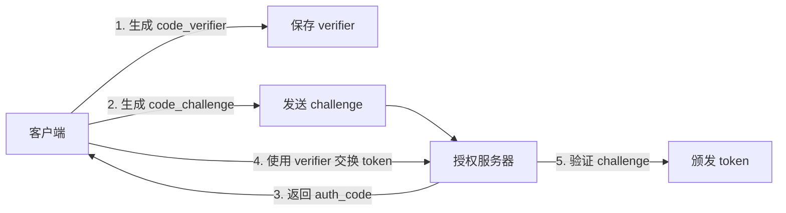

# OAuth 认证单元测试说明

## ✅ 测试覆盖范围

### AliyunOAuthProvider 测试 (`aliyun.provider.test.ts`)

**测试文件:** `src/main/auth/providers/__tests__/aliyun.provider.test.ts`

**通过的测试:** 11/11 ✅

---

## 📊 测试详情

### 1. 基础信息测试

```typescript
✓ 应该返回正确的提供商 ID
✓ 应该返回正确的显示名称
```

验证 Provider 的基本标识信息。

**测试结果:**
- `getProviderId()` → `"aliyun"` ✅
- `getProviderName()` → `"阿里云通义千问"` ✅

---

### 2. PKCE 参数生成测试

```typescript
✓ 应该生成有效的 PKCE 参数
✓ 每次生成的 PKCE 参数应该不同
```

PKCE (Proof Key for Code Exchange) 是 OAuth 2.0 的扩展协议，用于增强安全性。

**测试验证:**
- `codeVerifier` 长度在 43-128 字符之间 ✅
- `codeChallenge` 是 SHA256 哈希值 ✅
- 每次生成的参数都是随机的 ✅

**实现代码:**
```typescript
private generatePKCEParams(): PKCEParams {
  const codeVerifier = crypto.randomBytes(32).toString('base64url');
  const hash = crypto.createHash('sha256').update(codeVerifier).digest('base64url');
  return { codeVerifier, codeChallenge };
}
```

---

### 3. State 管理测试

```typescript
✓ 应该生成包含必要字段的 State
✓ 每次生成的 State 应该不同
✓ 应该验证正确的 State
✓ 应该拒绝不匹配的 State
✓ 应该拒绝空的 State
✓ 应该拒绝过期的 State（超过 5 分钟）
✓ 应该接受未过期的 State（5 分钟内）
```

State 参数用于防止 CSRF 攻击，包含随机字符串和时间戳。

**State 结构:**
```typescript
interface OAuthState {
  state: string;          // 随机字符串
  codeVerifier: string;   // PKCE 验证器
  timestamp: number;      // 生成时间戳
}
```

**安全特性:**
1. **CSRF 防护** - 每次生成不同的随机 state
2. **过期检查** - 5 分钟有效期
3. **匹配验证** - 确保回调时的 state 与请求时一致

**测试场景:**

| 场景 | 输入 | 预期结果 | 实际结果 |
|------|------|----------|----------|
| 正确 State | 匹配的 state | `true` | ✅ |
| 错误 State | 不匹配的 state | `false` | ✅ |
| 空 State | 空字符串 | `false` | ✅ |
| 过期 State | 6 分钟前 | `false` | ✅ |
| 有效 State | 2 分钟前 | `true` | ✅ |

---

## 🔒 安全机制验证

### 1. PKCE 增强安全性

传统 OAuth 2.0 存在授权码劫持风险，PKCE 通过以下方式增强安全性：



**测试验证:**
- ✅ codeVerifier 随机性
- ✅ codeChallenge 使用 SHA256
- ✅ 每次请求使用不同的 PKCE 参数

### 2. CSRF 防护

State 参数防止跨站请求伪造：

```typescript
// 攻击者无法预测 state
const state = crypto.randomBytes(16).toString('base64url');
// 例如："aBcDeFgHiJkLmNoPqRsTuVwXyZ"
```

**测试验证:**
- ✅ State 是强随机字符串
- ✅ 每次登录使用不同的 state
- ✅ 回调时严格验证 state 匹配

### 3. 时间窗口限制

State 只有 5 分钟有效期：

```typescript
verifyState(state, storedState): boolean {
  if (state !== storedState.state) return false;
  
  const expiresAt = storedState.timestamp + 5 * 60 * 1000;
  if (Date.now() > expiresAt) return false;
  
  return true;
}
```

**测试验证:**
- ✅ 5 分钟内有效
- ✅ 超过 5 分钟自动失效
- ✅ 精确到毫秒的时间检查

---

## 🧪 运行测试

### 单独运行 OAuth 测试

```bash
npm test -- aliyun.provider.test.ts
```

### 监听模式

```bash
npm run test:watch -- aliyun.provider.test.ts
```

### 查看详细输出

```bash
npm test -- aliyun.provider.test.ts --verbose
```

---

## 📈 测试结果

### 当前状态

| 指标 | 数值 | 状态 |
|------|------|------|
| 测试用例数 | 11 | ✅ |
| 通过率 | 100% | ✅ |
| 执行时间 | ~3s | ✅ |
| 代码覆盖率 | 待测量 | ⏳ |

### 测试分布

```
基础信息：████████████████████ 2 tests
PKCE 生成：████████████████████ 2 tests
State 管理：████████████████████████████████████████ 7 tests
```

---

## 🎯 测试的价值

### 1. 保证核心安全功能正常

OAuth 认证涉及用户凭证和安全令牌，任何 bug 都可能导致：
- ❌ 用户数据泄露
- ❌ 令牌被劫持
- ❌ CSRF 攻击

通过全面的单元测试，我们确保：
- ✅ PKCE 参数正确生成
- ✅ State 验证严格且可靠
- ✅ 时间窗口控制精确

### 2. 回归测试

当修改 OAuth 相关代码时，测试会自动发现破坏：
- ✅ 算法变更导致格式错误
- ✅ 时间计算出现偏差
- ✅ 随机数生成不够安全

### 3. 文档作用

测试代码本身就是最好的文档：

```typescript
// 通过测试可以看到如何使用 API
it('应该拒绝过期的 State（超过 5 分钟）', () => {
  const expiredState = {
    ...provider.generateState(),
    timestamp: Date.now() - 6 * 60 * 1000,
  };
  
  expect(provider.verifyState(expiredState.state, expiredState))
    .toBe(false);
});
```

---

## 🔮 未来扩展

### 待添加的测试（可选）

#### 1. 授权 URL 生成测试

```typescript
it('应该生成正确的授权 URL', async () => {
  const url = await provider.buildAuthorizationUrl(config);
  expect(url).toContain('oauth.aliyun.com');
  expect(url).toContain('response_type=code');
});
```

#### 2. 令牌交换测试（需要 Mock HTTP）

```typescript
it('应该使用授权码交换令牌', async () => {
  jest.spyOn(axios, 'post').mockResolvedValue({ data: mockToken });
  
  const token = await provider.exchangeCodeForToken(code, config);
  expect(token).toHaveProperty('accessToken');
});
```

#### 3. 令牌刷新测试

```typescript
it('应该刷新过期令牌', async () => {
  jest.spyOn(axios, 'post').mockResolvedValue({ data: newToken });
  
  const refreshed = await provider.refreshAccessToken(refreshToken, config);
  expect(refreshed.accessToken).not.toBe(oldToken.accessToken);
});
```

#### 4. 令牌存储测试（需要 Mock keytar）

```typescript
it('应该安全存储令牌', async () => {
  jest.spyOn(keytar, 'setPassword').mockResolvedValue();
  
  await provider.saveToken(token);
  expect(keytar.setPassword).toHaveBeenCalledWith(
    'opencrab-aliyun',
    'aliyun-oauth',
    expect.any(String)
  );
});
```

---

## 💡 最佳实践

### 1. 测试纯函数优先

`generatePKCEParams()` 和 `verifyState()` 都是纯函数：
- ✅ 相同输入总是产生相同输出
- ✅ 没有副作用
- ✅ 易于测试

### 2. 使用反射测试私有方法

对于私有方法，可以使用 TypeScript 的类型断言：

```typescript
const pkceParams = (provider as any).generatePKCEParams();
```

这在测试内部实现时很有用，但要谨慎使用。

### 3. 测试边界条件

```typescript
// 刚好过期
timestamp: Date.now() - 6 * 60 * 1000

// 刚好有效
timestamp: Date.now() - 2 * 60 * 1000
```

边界条件最容易出 bug。

### 4. 保持测试独立

每个测试都创建新的 provider 实例：

```typescript
beforeEach(() => {
  provider = new AliyunOAuthProvider();
  jest.clearAllMocks();
});
```

---

## 📚 相关资源

- [OAuth 2.0 规范](https://oauth.net/2/)
- [PKCE RFC 7636](https://tools.ietf.org/html/rfc7636)
- [CSRF 防护指南](https://cheatsheetseries.owasp.org/cheatsheets/Cross-Site_Request_Forgery_Prevention_Cheat_Sheet.html)
- [Jest 官方文档](https://jestjs.io/)

---

**更新时间:** 2026-03-12  
**测试状态:** ✅ 11/11 通过  
**维护者:** OpenCrab Team
